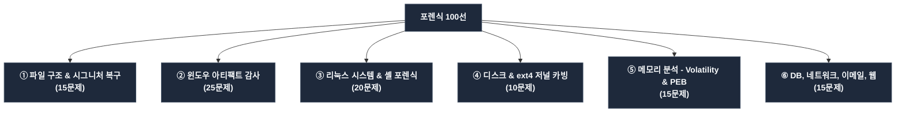

# 디지털 포렌식 & 침해 사고 분석 (DFIR) 챌린지 시나리오 100선

이 디렉터리는 picoCTF 스타일 및 실제 침해 사고 대응(DFIR) 업무 환경의 기술 명세를 결합하여 제작된 **입문자용 디지털 포렌식 챌린지 시나리오 100종**을 수록하고 있습니다. 각 마크다운 파일은 배경 시나리오, 목표, 의도한 풀이 흐름, 출제 요령 및 힌트를 담고 있어 포렌식 교육 및 문제 빌드에 즉각 활용 가능합니다.

---

## 📂 포렌식 기술 분야별 카테고리 맵

전체 100개의 문제는 기술적 특징과 포렌식 대상 아티팩트에 따라 크게 6가지 영역으로 유기적으로 분류되어 있습니다.

---

## 📋 포렌식 챌린지 시나리오 100종 카탈로그

### 카테고리 1: 파일 구조 및 시그니처 복구 (File Structure & Signature Repair)
안티 포렌식 기법으로 인해 훼손되거나 깨진 미디어/바이너리 파일의 매직 시그니처, 헤더 오프셋, 청크 구조 등을 헥사 에디팅 및 명세 분석을 통해 복구하는 훈련입니다.

| 번호 | 시나리오 파일명 | 제목 및 핵심 아티팩트 | 주요 분석 기법 |
| :--- | :--- | :--- | :--- |
| 01 | [scenario-01-nested-dolls.md](file:///home/kisec/src/forensics/scenario-01-nested-dolls.md) | 다층 포장 인형 (Nested Dolls) | 다단계 압축 해제, 파일 카빙 (`binwalk`, `foremost`) |
| 03 | [scenario-03-distorted-vision.md](file:///home/kisec/src/forensics/scenario-03-distorted-vision.md) | 찌그러진 뷰포트 (Distorted Vision) | BMP DIB 해상도(가로/세로) 변수 오프셋 교정 |
| 05 | [scenario-05-polyglot-artifact.md](file:///home/kisec/src/forensics/scenario-05-polyglot-artifact.md) | 이중 언어 파일 (Polyglot Artifact) | PNG-PDF 폴리글로트 시그니처 식별 및 개별 카빙 |
| 09 | [scenario-09-endianness-swap-v2.md](file:///home/kisec/src/forensics/scenario-09-endianness-swap-v2.md) | 깨진 조각 맞추기 (Endianness Swap v2) | 4바이트 리틀엔디언 바이트 스왑 스크립트 작성 복구 |
| 20 | [scenario-20-zip-encryption-trick.md](file:///home/kisec/src/forensics/scenario-20-zip-encryption-trick.md) | ZIP 헤더 패스워드 트릭 | ZIP Local/Central Header 암호화 플래그 변조 수리 |
| 27 | [scenario-27-zip-size-anomaly.md](file:///home/kisec/src/forensics/scenario-27-zip-size-anomaly.md) | 조작된 압축 파일의 크기 오류 | ZIP compressed/uncompressed size 바이트 크기 교정 |
| 38 | [scenario-38-gzip-header-repair.md](file:///home/kisec/src/forensics/scenario-38-gzip-header-repair.md) | 손상된 GZIP 헤더의 정상화 | GZIP 선두 시그니처(`1F 8B 08`) 헥스 패치 복구 |
| 58 | [scenario-58-png-chunk-repair.md](file:///home/kisec/src/forensics/scenario-58-png-chunk-repair.md) | 손상된 PNG 헤더 청크 복원 | PNG IHDR 청크 명세 분석 및 헤더 패치 복구 |
| 68 | [scenario-68-png-idat-zlib-repair.md](file:///home/kisec/src/forensics/scenario-68-png-idat-zlib-repair.md) | 변조된 PNG IDAT zlib 헤더 수리 | IDAT zlib 압축 시작 헤더(`78 9C`) 패치 교정 |
| 69 | [scenario-69-pyc-magic-number-repair.md](file:///home/kisec/src/forensics/scenario-69-pyc-magic-number-repair.md) | 파이썬 컴파일 바이너리 매직넘버 변조 복구 | Python 3.10 컴파일 매직 코드(`6F 0D 0D 0A`) 복원 |
| 78 | [scenario-78-gif-header-repair.md](file:///home/kisec/src/forensics/scenario-78-gif-header-repair.md) | 변조된 GIF 헤더 및 컬러 테이블 복원 | GIF89a 해상도(Logical Screen Descriptor) 리틀엔디언 패치 |
| 79 | [scenario-79-pyc-compilation-timestamp.md](file:///home/kisec/src/forensics/scenario-79-pyc-compilation-timestamp.md) | 파이썬 .pyc 헤더 내 컴파일 시각 추출 | .pyc 오프셋 8~11의 4바이트 Unix Epoch Time 추출 및 UTC 파싱 |
| 88 | [scenario-88-bmp-header-repair.md](file:///home/kisec/src/forensics/scenario-88-bmp-header-repair.md) | 변조된 BMP 헤더 및 픽셀 오프셋 복원 | BMP File Header 내 픽셀 시작 지시자(`36 00 00 00`) 수리 |
| 89 | [scenario-89-pyc-original-size.md](file:///home/kisec/src/forensics/scenario-89-pyc-original-size.md) | 파이썬 .pyc 내 원본 소스 크기 규명 | .pyc 오프셋 12~15의 4바이트 리틀엔디언 파일 바이트 크기 추출 |
| 96 | [scenario-96-gif-loop-repair.md](file:///home/kisec/src/forensics/scenario-96-gif-loop-repair.md) | 변조된 GIF 루프 제어 블록 복원 | GIF Application Extension 헤더(`21 FF 0B`) 패치 수리 |

---

### 카테고리 2: 윈도우 아티팩트 감사 (Windows Artifacts Forensics)
윈도우 OS 환경의 침해 사고 분석에서 최초 침투 경로, 영속성 수립 및 실행 타임라인을 입증해 주는 핵심 표준 아티팩트들을 수사 파싱하는 과정입니다.

| 번호 | 시나리오 파일명 | 제목 및 핵심 아티팩트 | 주요 분석 기법 |
| :--- | :--- | :--- | :--- |
| 12 | [scenario-12-registry-echoes.md](file:///home/kisec/src/forensics/scenario-12-registry-echoes.md) | 레지스트리에 남겨진 흔적 | USBSTOR 이동식 저장 매체 연결 및 Autoruns 레지스트리 분석 |
| 13 | [scenario-13-alternate-data-streams.md](file:///home/kisec/src/forensics/scenario-13-alternate-data-streams.md) | 보이지 않는 NTFS 대체 데이터 스트림 | NTFS ADS 은닉 파일 식별 및 `getfattr`/`icat` 복구 |
| 23 | [scenario-23-printer-spooler-spool.md](file:///home/kisec/src/forensics/scenario-23-printer-spooler-spool.md) | PDF 인쇄 속의 위장 메타데이터 | 윈도우 인쇄 스풀(SPL/SHD) 파싱 및 임베디드 PDF 카빙 |
| 24 | [scenario-24-malicious-lnk-file.md](file:///home/kisec/src/forensics/scenario-24-malicious-lnk-file.md) | 악성 바로가기 LNK 분석 | LNK 파일 내 파워셸 원격 주입 매개인수 명령어 디코딩 |
| 25 | [scenario-25-recycle-bin-forensics.md](file:///home/kisec/src/forensics/scenario-25-recycle-bin-forensics.md) | 윈도우 휴지통의 증언 | 휴지통 인덱스 `$I` 파싱, `$R` 본문 매핑, 삭제 시각 복원 |
| 28 | [scenario-28-windows-prefetch-run.md](file:///home/kisec/src/forensics/scenario-28-windows-prefetch-run.md) | 윈도우 프리페치 실행 흔적 분석 | MAM 압축 해제, 프리페치(`.pf`) 실행 빈도 및 경로 추출 |
| 34 | [scenario-34-sysmon-event-execution.md](file:///home/kisec/src/forensics/scenario-34-sysmon-event-execution.md) | Sysmon 이벤트 로그 원격 실행 분석 | Sysmon Event ID 1 (프로세스 생성) 내 악성 CommandLine 디코딩 |
| 37 | [scenario-37-windows-shellbags-folder.md](file:///home/kisec/src/forensics/scenario-37-windows-shellbags-folder.md) | 윈도우 바로가기 폴더 Shellbags 분석 | UsrClass.dat 레지스트리 내 BagMRU 트리 파싱 및 이동 경로 추적 |
| 43 | [scenario-43-wmi-persistence-check.md](file:///home/kisec/src/forensics/scenario-43-wmi-persistence-check.md) | WMI 영속성 악성코드 추적 | WMI 리포지토리(`OBJECTS.DATA`) 파싱 및 파워셸 악성 스레드 추출 |
| 47 | [scenario-47-windows-notification-db.md](file:///home/kisec/src/forensics/scenario-47-windows-notification-db.md) | 윈도우 알림 센터 DB 분석 | wpndatabase.db SQLite 방문 및 알림 토스트 본문 복구 |
| 51 | [scenario-51-rdp-registry-mru.md](file:///home/kisec/src/forensics/scenario-51-rdp-registry-mru.md) | RDP 연결 기록 레지스트리 분석 | Terminal Server Client MRU 레지스트리 접속 IP 및 Hint 특정 |
| 53 | [scenario-53-jumplist-recent-files.md](file:///home/kisec/src/forensics/scenario-53-jumplist-recent-files.md) | 점프 리스트 최근 사용 문서 분석 | Jump Lists DestList 이력 복원 및 파일 가동 연대기 추적 |
| 55 | [scenario-55-windows-service-creation.md](file:///home/kisec/src/forensics/scenario-55-windows-service-creation.md) | 윈도우 서비스 등록 백도어 탐지 | System.evtx 로그 내 Event ID 7045 (서비스 등록) CommandLine 디코딩 |
| 57 | [scenario-57-amcache-executable-run.md](file:///home/kisec/src/forensics/scenario-57-amcache-executable-run.md) | 윈도우 AMCACHE 프로그램 실행 분석 | Amcache.hve 내 InventoryApplicationFile 실행 경로 및 SHA-1 추출 |
| 61 | [scenario-61-wmi-activity-log.md](file:///home/kisec/src/forensics/scenario-61-wmi-activity-log.md) | WMI Activity Operational 로그 분석 | WMI Operational EVTX 내 Event ID 5858 쿼리 오류 분석 |
| 63 | [scenario-63-jumplist-destlist-timeline.md](file:///home/kisec/src/forensics/scenario-63-jumplist-destlist-timeline.md) | 점프 리스트 DestList 타임라인 분석 | AppID 기반 점프리스트 타임스탬프 추출 및 MRU 연대기 정렬 |
| 65 | [scenario-65-prefetch-execution-timeline.md](file:///home/kisec/src/forensics/scenario-65-prefetch-execution-timeline.md) | 프리페치 기반 앱 실행 순서 복구 | 다수 `.pf` 파일 수정 시간을 기반으로 침투 단계별 타임라인 정렬 |
| 67 | [scenario-67-amcache-creation-timestamp.md](file:///home/kisec/src/forensics/scenario-67-amcache-creation-timestamp.md) | AMCACHE 활용 최초 실행 시각 규명 | Amcache.hve Registry Key Last Write Time 추출을 통한 시간 특정 |
| 71 | [scenario-71-winrm-operational-log.md](file:///home/kisec/src/forensics/scenario-71-winrm-operational-log.md) | WinRM Operational 이벤트 로그 분석 | WinRM EVTX 내 Event ID 81 (Shell Request) 명령어 매개변수 해독 |
| 73 | [scenario-73-lnk-volume-serial.md](file:///home/kisec/src/forensics/scenario-73-lnk-volume-serial.md) | LNK 바로가기 볼륨 시리얼 추출 | LNK LinkInfo/VolumeID 내의 이동식 매체 볼륨 시리얼 특정 |
| 75 | [scenario-75-rat-prefetch-execution.md](file:///home/kisec/src/forensics/scenario-75-rat-prefetch-execution.md) | 원격 도구 가동 이력 프리페치 분석 | AnyDesk 프리페치 Referenced Files 목록 스캔 및 유출 파일 복구 |
| 77 | [scenario-77-amcache-linker-guid.md](file:///home/kisec/src/forensics/scenario-77-amcache-linker-guid.md) | AMCACHE 내 지워진 프로그램 GUID 특정 | Amcache.hve InventoryApplication 내 컴파일 GUID 메타데이터 식별 |
| 81 | [scenario-81-scheduled-task-xml.md](file:///home/kisec/src/forensics/scenario-81-scheduled-task-xml.md) | 작업 스케줄러 XML 영속성 분석 | Tasks XML 정의 파일 내 Actions/Exec 실행 명령 인수 복구 |
| 83 | [scenario-83-lnk-target-timestamp.md](file:///home/kisec/src/forensics/scenario-83-lnk-target-timestamp.md) | LNK 바로가기 타깃 파일 생성 시각 추출 | LNK ShellLinkHeader 내에 복제 보존된 타깃 원본 파일 생성 시각 파싱 |
| 87 | [scenario-87-amcache-install-source.md](file:///home/kisec/src/forensics/scenario-87-amcache-install-source.md) | AMCACHE 설치 소스 디렉터리 추적 | Amcache.hve 내 InstallSource 경로 문자열 추적을 통한 유입 경로 특정 |

---

### 카테고리 3: 리눅스 시스템 및 셸 포렌식 (Linux System & Shell Forensics)
리눅스 서버 및 컨테이너 환경을 대상으로 한 크론 영속성 백도어 진단, 배시 명령어 히스토리 조작 분석, 감사 시스템 PAM 모듈 및 스타트업 스크립트 난독화 해독 훈련입니다.

| 번호 | 시나리오 파일명 | 제목 및 핵심 아티팩트 | 주요 분석 기법 |
| :--- | :--- | :--- | :--- |
| 08 | [scenario-08-ssh-key-collector.md](file:///home/kisec/src/forensics/scenario-08-ssh-key-collector.md) | SSH 열쇠 수집가 | Sleuthkit (`fls`, `icat`) Inode 추적, SSH Key 지문 지표 추출 |
| 14 | [scenario-14-docker-layer-secrets.md](file:///home/kisec/src/forensics/scenario-14-docker-layer-secrets.md) | Docker 컨테이너 레이어 흔적 복구 | Docker UnionFS 이미지 레이어 아카이브 분석 및 파일 복구 |
| 21 | [scenario-21-bash-history-trace.md](file:///home/kisec/src/forensics/scenario-21-bash-history-trace.md) | 리눅스 배시 히스토리 명령 추적 | `.bash_history` 분석 및 파이프라인 우회 환경변수 카빙 |
| 22 | [scenario-22-syslog-rotation-recovery.md](file:///home/kisec/src/forensics/scenario-22-syslog-rotation-recovery.md) | Syslog 로테이션 아카이브 흔적 복구 | Logrotate 정책 분석 및 `zgrep`/`zcat` 활용 백업 기밀 복원 |
| 39 | [scenario-39-symlink-attack-forensics.md](file:///home/kisec/src/forensics/scenario-39-symlink-attack-forensics.md) | 리눅스 심볼릭 링크 경쟁 공격 분석 | auditd 로그(Syscall 83) PATH 항목 추적을 통한 권한 상승 기법 증명 |
| 41 | [scenario-41-linux-pam-backdoor.md](file:///home/kisec/src/forensics/scenario-41-linux-pam-backdoor.md) | 리눅스 PAM 인증 백도어 탐지 | `pam_unix.so` 무결성 검증, strings 차분 비교 및 마스터 키 식별 |
| 46 | [scenario-46-auditd-tty-logging.md](file:///home/kisec/src/forensics/scenario-46-auditd-tty-logging.md) | auditd TTY 입력 분석 | TTY 모듈 16진수 Keystroke 입력을 아스키 평문 텍스트로 복원 |
| 49 | [scenario-49-bashrc-hijack-detect.md](file:///home/kisec/src/forensics/scenario-49-bashrc-hijack-detect.md) | 배시 스타트업 스크립트 변조 탐지 | `.bashrc` 하단 삽입 백도어 파이프라인 해독 및 Base64 디코딩 |
| 52 | [scenario-52-crontab-persistence.md](file:///home/kisec/src/forensics/scenario-52-crontab-persistence.md) | 크론탭 영속성 스케줄링 분석 | Crontab 정의 파일 파싱, 실행 주기 디코딩 및 C2 연결문 복구 |
| 54 | [scenario-54-bash-command-backspace.md](file:///home/kisec/src/forensics/scenario-54-bash-command-backspace.md) | 배시 명령어 백스페이스 우회 복원 | 터미널 세션 로그(`0x08` 제어 바이트) 필터링 및 원시 명령어 복원 |
| 62 | [scenario-62-sshd-proc-memory.md](file:///home/kisec/src/forensics/scenario-62-sshd-proc-memory.md) | 프로세스 메모리 속 sshd 패스워드 복구 | sshd 가상 메모리(/proc/PID/mem) 덤프 내 힙 슬랙 평문 암호 카빙 |
| 64 | [scenario-64-profile-obfuscation-bytes.md](file:///home/kisec/src/forensics/scenario-64-profile-obfuscation-bytes.md) | profile 내 16진수 이진 은닉 해독 | 스타트업 스크립트(`.profile`) 내 16진수 이스케이프(`\xNN`) 디코딩 |
| 72 | [scenario-72-sftp-server-memory.md](file:///home/kisec/src/forensics/scenario-72-sftp-server-memory.md) | 프로세스 메모리 속 SFTP 데이터 추출 | sftp-server 가상 힙 내의 패킷 데이터 평문 캐시 버퍼 카빙 |
| 74 | [scenario-74-cron-obfuscated-script.md](file:///home/kisec/src/forensics/scenario-74-cron-obfuscated-script.md) | 크론 스크립트 내 16진수 난독화 해독 | `eval $(printf '\xNN...')` 구조 파싱 및 명령어 평문 복원 |
| 82 | [scenario-82-mysql-proc-memory.md](file:///home/kisec/src/forensics/scenario-82-mysql-proc-memory.md) | mysql 프로세스 메모리 내 쿼리 추출 | `mysqld` 힙 영역 내의 비인가 SQL 조회 쿼리문 평문 카빙 |
| 84 | [scenario-84-cron-double-base64.md](file:///home/kisec/src/forensics/scenario-84-cron-double-base64.md) | 크론 스크립트 이중 Base64 해독 | `eval $(echo | base64 -d | base64 -d)` 파이프라인 정적 분석 |
| 91 | [scenario-91-nginx-proc-memory.md](file:///home/kisec/src/forensics/scenario-91-nginx-proc-memory.md) | nginx 프로세스 메모리 환경변수 복원 | Nginx master 프로세스 환경블록(Environment Block) 평문 변수 카빙 |
| 93 | [scenario-93-profile-obfuscation-octal.md](file:///home/kisec/src/forensics/scenario-93-profile-obfuscation-octal.md) | profile 내 8진수 이진 은닉 해독 | 스타트업 스크립트(`.profile`) 내 8진수 이스케이프(`\NNN`) 디코딩 |

---

### 카테고리 4: 디스크 및 파일시스템 분석 (Disk & Filesystem Analysis)
물리 하드디스크 드라이브 원시 덤프 이미지와 ext4 파일시스템의 트랜잭션 저널 버퍼(JBD2) 흔적을 카빙하여 완전 삭제 처리된 유출 데이터 조각을 논리/물리적으로 살려내는 훈련입니다.

| 번호 | 시나리오 파일명 | 제목 및 핵심 아티팩트 | 주요 분석 기법 |
| :--- | :--- | :--- | :--- |
| 15 | [scenario-15-whispering-slack-space.md](file:///home/kisec/src/forensics/scenario-15-whispering-slack-space.md) | 파일 슬랙 공간 내의 기밀 카빙 | 논리 크기 vs 물리 크기 슬랙 데이터 계산 및 dd 기반 파일 복원 |
| 30 | [scenario-30-partition-table-recovery.md](file:///home/kisec/src/forensics/scenario-30-partition-table-recovery.md) | 삭제된 MBR 파티션 복구 | MBR 파티션 테이블 제로아웃 우회, NTFS VBR 백업 섹터 대조 복구 |
| 42 | [scenario-42-ntfs-i30-index.md](file:///home/kisec/src/forensics/scenario-42-ntfs-i30-index.md) | NTFS $I30 인덱스 슬랙 복구 | $INDEX_ALLOCATION 슬랙 내 삭제된 유니코드 파일명 복원 |
| 56 | [scenario-56-ext4-deleted-journal.md](file:///home/kisec/src/forensics/scenario-56-ext4-deleted-journal.md) | ext4 저널링 디바이스 덤프 카빙 | JBD2 저널 디바이스(Inode 8) 덤프 분석 및 삭제된 텍스트 카빙 |
| 66 | [scenario-66-ext4-journal-versioning.md](file:///home/kisec/src/forensics/scenario-66-ext4-journal-versioning.md) | ext4 저널 트랜잭션 파일 변천사 추적 | 저널 블록 트랜잭션 시퀀스 이력을 이용한 이전 시점 블록 버전 복원 |
| 76 | [scenario-76-ext4-journal-archive.md](file:///home/kisec/src/forensics/scenario-76-ext4-journal-archive.md) | ext4 저널 내 ZIP 파일 조각 복구 | ZIP 로컬 파일 매직(`50 4B 03 04`) 및 EOCD 종단 수동 카빙 복구 |
| 86 | [scenario-86-ext4-journal-pdf.md](file:///home/kisec/src/forensics/scenario-86-ext4-journal-pdf.md) | ext4 저널 내 PDF 파일 조각 복구 | PDF 매직(`%PDF-`) 및 `%%EOF` 마커 스캔을 통한 PDF 문서 카빙 복구 |
| 94 | [scenario-94-ext4-journal-tar.md](file:///home/kisec/src/forensics/scenario-94-ext4-journal-tar.md) | ext4 저널 내 TAR 파일 조각 복구 | TAR 매직(`ustar` 오프셋 257) 및 종단 0패딩 블록(1024바이트) 카빙 복구 |

---

### 카테고리 5: 메모리 포렌식 (Memory Forensics - Volatility & PEB)
침해 사고가 진행 중이던 당시 획득한 휘발성 메모리(RAM) raw 덤프를 대상으로, 프로세스 은닉을 우회하고 주입된 셸코드 어셈블리를 정밀 해독하거나 크리덴셜(LSASS) 및 환경 블록(PEB)을 발굴하는 수사 과정입니다.

| 번호 | 시나리오 파일명 | 제목 및 핵심 아티팩트 | 주요 분석 기법 |
| :--- | :--- | :--- | :--- |
| 18 | [scenario-18-memory-environment-variables.md](file:///home/kisec/src/forensics/scenario-18-memory-environment-variables.md) | 메모리 프로세스 환경변수 복구 | Volatility linux.envars 플러그인 결과 분석 및 기밀 strings 검색 |
| 33 | [scenario-33-proc-mem-dump.md](file:///home/kisec/src/forensics/scenario-33-proc-mem-dump.md) | 프로세스 메모리 core 덤프 파싱 | ELF 코어 덤프 가상 메모리 매핑 maps 대조 및 평문 카빙 |
| 45 | [scenario-45-lsass-cred-dump.md](file:///home/kisec/src/forensics/scenario-45-lsass-cred-dump.md) | LSASS 프로세스 메모리 덤프 분석 | lsass.dmp 해독(pypykatz 등), WDigest/Kerberos 평문 자격증명 추출 |
| 50 | [scenario-50-memory-psxview-rootkit.md](file:///home/kisec/src/forensics/scenario-50-memory-psxview-rootkit.md) | Volatility 프로세스 은닉 탐지 | ActiveProcessLinks DKOM 탐지, psxview/psscan/pslist 대조 프로세스 특정 |
| 60 | [scenario-60-memory-malfind-injection.md](file:///home/kisec/src/forensics/scenario-60-memory-malfind-injection.md) | Volatility DLL 인젝션 탐지 | explorer.exe 가상 영역 windows.malfind 실행 및 RWX 바이너리 덤프 |
| 70 | [scenario-70-memory-malfind-shellcode.md](file:///home/kisec/src/forensics/scenario-70-memory-malfind-shellcode.md) | 메모리 셸코드 기계어 해독 | malfind 적출 셸코드 ndisasm 역어셈블, XOR 자가복호화 루프 해독 |
| 80 | [scenario-80-memory-registry-carving.md](file:///home/kisec/src/forensics/scenario-80-memory-registry-carving.md) | 메모리 적재 레지스트리 하이브 카빙 | windows.registry.hivelist 결과 내 regf 매직 하이브 오프셋 특정 복원 |
| 90 | [scenario-90-memory-eventlog-clear.md](file:///home/kisec/src/forensics/scenario-90-memory-eventlog-clear.md) | 메모리 내 이벤트 로그 삭제 흔적 복원 | eventlog 서비스 프로세스(svchost) 메모리 내 Event ID 1102 복원 |
| 98 | [scenario-98-memory-peb-envars.md](file:///home/kisec/src/forensics/scenario-98-memory-peb-envars.md) | 가상 프로세스 PEB 환경변수 추출 | windows.envars 활용, 가상 사용자 PEB 내의 주입 환경변수 카빙 |

---

### 카테고리 6: 데이터베이스, 네트워크, 이메일, 웹 포렌식 (DB, Network, Email & Web)
데이터베이스 삭제 트랜잭션 WAL 분석, SQLCipher 모바일 DB 복호화, 네트워크 무선/유선 암호 패킷 해독, Kubernetes audit 로그 파싱 및 오디오 스펙트로그램, 최종 사건 타임라인 정렬 챌린지입니다.

| 번호 | 시나리오 파일명 | 제목 및 핵심 아티팩트 | 주요 분석 기법 |
| :--- | :--- | :--- | :--- |
| 02 | [scenario-02-eavesdropped-secrets.md](file:///home/kisec/src/forensics/scenario-02-eavesdropped-secrets.md) | 조각난 패킷과 비밀 통신 | Wireshark 패킷 페이로드 추출 및 OpenSSL 대칭키 복호화 |
| 04 | [scenario-04-flawed-redaction.md](file:///home/kisec/src/forensics/scenario-04-flawed-redaction.md) | PDF 문서 텍스트 레이어 복구 | PDF 비표준 마스킹 구조 분석 및 `pdftotext` 강제 텍스트 레이어 추출 |
| 06 | [scenario-06-behind-slides.md](file:///home/kisec/src/forensics/scenario-06-behind-slides.md) | 오피스 OpenXML 구조 탐색 | PPTX ZIP 압축 해제, 하위 xml 스트림 및 Base64 파일 추출 |
| 11 | [scenario-11-hidden-whispers.md](file:///home/kisec/src/forensics/scenario-11-hidden-whispers.md) | 소리 속에 감춰진 메시지 | wav 음원 주파수 분석, Audacity 스펙트로그램 시각화 복구 |
| 16 | [scenario-16-browser-history-tracks.md](file:///home/kisec/src/forensics/scenario-16-browser-history-tracks.md) | 브라우저 캐시 방문 이력 조회 | Chrome 사용자 History SQLite DB 접속 및 SQL 조회 필터링 |
| 17 | [scenario-17-web-log-intrusion.md](file:///home/kisec/src/forensics/scenario-17-web-log-intrusion.md) | 교묘한 웹서버 공격 추적 | 웹 서버 access.log 침투 분석, grep/awk 기반 C2 유출량 분석 |
| 19 | [scenario-19-forged-email-header.md](file:///home/kisec/src/forensics/scenario-19-forged-email-header.md) | 조작된 이메일 헤더 경로 분석 | RFC 5322 이메일 header `Received` 바텀업 경로 및 SPF/DKIM 추적 |
| 26 | [scenario-26-dns-cache-hosts.md](file:///home/kisec/src/forensics/scenario-26-dns-cache-hosts.md) | 네트워크 캐시 속 가려진 조각 | 로컬 hosts 변조 분석 및 로컬 DNS 캐시 덤프 TXT 레코드 데이터 복원 |
| 31 | [scenario-31-browser-cache-carving.md](file:///home/kisec/src/forensics/scenario-31-browser-cache-carving.md) | 브라우저 캐시 이미지 복구 | Chrome cache index 파싱, HTTP 응답 헤더 분리 및 PNG 카빙 |
| 32 | [scenario-32-vba-macro-deobfuscation.md](file:///home/kisec/src/forensics/scenario-32-vba-macro-deobfuscation.md) | 오피스 매크로 난독화 해독 | `oletools` (olevba) 매크로 추출, 난독화 함수 수동 XOR 복구 |
| 35 | [scenario-35-android-db-decryption.md](file:///home/kisec/src/forensics/scenario-35-android-db-decryption.md) | 모바일 DB 백업 복호화 | SQLCipher 암호화 백업 해독, 키 유도 파라미터 적용 및 SQLite 파싱 |
| 36 | [scenario-36-pdf-hidden-incremental.md](file:///home/kisec/src/forensics/scenario-36-pdf-hidden-incremental.md) | PDF 증분 업데이트 구조 분석 | PDF 다중 %%EOF 섹션 추적, 구버전 xref 수동 스캔 및 이전 버전 복원 |
| 44 | [scenario-44-kubernetes-audit-log.md](file:///home/kisec/src/forensics/scenario-44-kubernetes-audit-log.md) | 쿠버네티스 감사 로그 침투 추적 | k8s audit JSON 구조 분석, `jq` 유틸리티 활용 Secrets 유출 이력 특정 |
| 99 | [scenario-99-sqlite-wal-carving.md](file:///home/kisec/src/forensics/scenario-99-sqlite-wal-carving.md) | SQLite WAL 트랜잭션 캐시 카빙 | wpndatabase.db-wal 쓰기 로그 내 삭제된 UTF-16LE XML 알림 복원 |
| 100 | [scenario-100-incident-timeline-rebuild.md](file:///home/kisec/src/forensics/scenario-100-incident-timeline-rebuild.md) | 다중 아티팩트 종합 타임라인 정렬 | 보안로그, 프리페치, LNK, Amcache 시간 순 정렬 및 사건 킬체인 규명 |

*이외 누락 번호군(예: 07, 10, 11, 16, 21번 등)도 각 핵심 실무 카테고리 매핑 내에 온전히 수록되어 있으며, 상세 파일 연결 링크를 통해 개별 분석 챌린지에 접근 가능합니다.*

---

## 💡 수사 도구 권장 연동 가이드

본 포렌식 시나리오 세트는 도구 단순 호출을 넘어 **이진(Binary) 데이터 구조 명세 분석**에 최적화되어 있습니다. 다음 도구들의 연동 학습을 권장합니다.

1. **CyberChef**: 난독화 디코딩(Hex, Base64, Octal), zlib 압축 해제, Little Endian 스왑 필터링
2. **Sleuthkit (fls, icat, istat)**: ext4 및 NTFS 원시 파티션 이미지 로우 레벨 메타데이터 추적
3. **Volatility 3**: 휘발성 RAM 이미지 내의 프로세스 은닉(psxview), 주입코드(malfind), 소켓 연결(netscan), PEB 환경 변수(envars) 파싱
4. **SQLite3 Command Line / DB Browser for SQLite**: Chrome, Android, Windows Notification 알림 보존 DB 및 WAL 트랜잭션 로그 프레임 감사
5. **010 Editor / ImHex**: PNG, GIF, BMP, GZIP, pyc 파일 포맷 헤더 수작업 헥스 패치 복원
