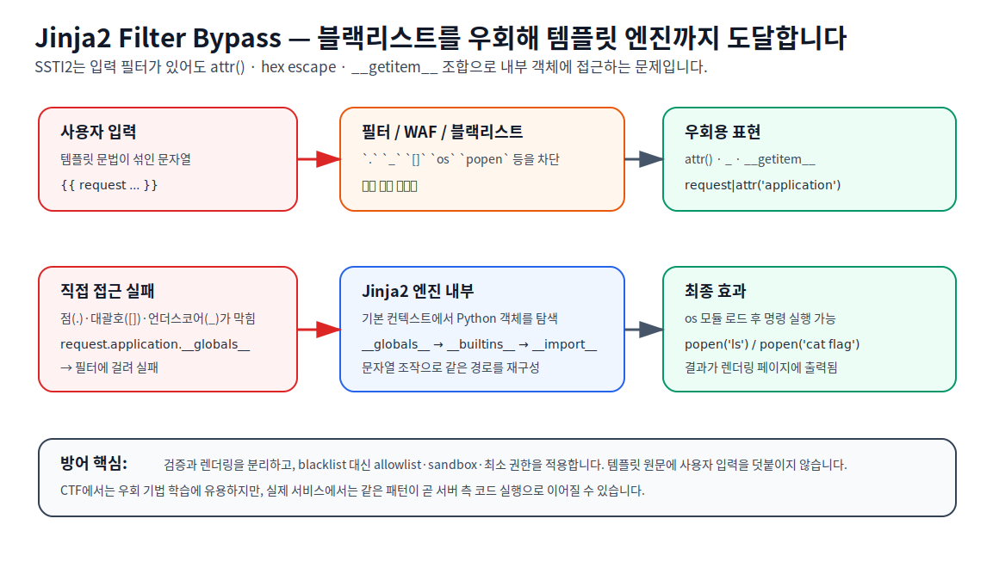

# Jinja2 Filter Bypass — 보안 용어 해설

## 참고 URL
- [medium.com](https://medium.com/@mihasha/ssti2-write-up-picoctf-2025-5fc53e2320ba)
- [www.ehchris.com](https://www.ehchris.com/blog/picoctf-ssti2-writeup)
- [hackmd.io](https://hackmd.io/@mv2XixOkQZyIZHzn48T8Tg/r1XtmrToge)
- [0day.work](https://0day.work/jinja2-template-injection-filter-bypasses/)
- [jinja.palletsprojects.com](https://jinja.palletsprojects.com/en/stable/sandbox/)
- [portswigger.net](https://portswigger.net/web-security/server-side-template-injection)
- [owasp.org](https://owasp.org/www-project-web-security-testing-guide/v41/4-Web_Application_Security_Testing/07-Input_Validation_Testing/18-Testing_for_Server_Side_Template_Injection)

## Step 1: 단어 직역 및 쉬운 비유

### 1. 용어 풀이

**Filter Bypass**는 말 그대로 **필터를 우회하는 것**입니다.  
여기서 필터는 Jinja2 템플릿 엔진 앞단의 **입력 검사기** 또는 **블랙리스트**를 뜻합니다.  
즉, `.` `__` `[]` `os` 같은 위험한 문자열을 막아보려는 시도입니다.

### 2. 의미 조합

> **Jinja2 Filter Bypass**는 Jinja2 기반 SSTI에서 입력 필터를 직접 부딪혀 깨는 대신, `attr()`·문자열 조립·hex escape 같은 우회 기법으로 같은 효과를 내는 방법입니다.

### 3. 쉬운 비유: "보안문이 너무 낮아서 옆문으로 들어가는 것"

건물 정문에는 경비원이 있고, 정문으로는 `금지 품목`이 적힌 가방을 못 들고 들어갑니다.  
그런데 안으로 들어가야 하는 사람은 가방을 나눠서 들고 오거나, 직원 출입용 옆문으로 들어가거나, 품목 이름을 다른 방식으로 적어 경비를 속입니다.

이게 바로 Filter Bypass의 핵심입니다.
- 정문 검사 = 블랙리스트
- 가방을 분해 = 문자열 조립
- 직원 출입증 = `attr()` 같은 대체 접근
- 품목 이름 위장 = `_` 같은 hex escape

결과적으로 보안문은 지나가지만, 내부에는 같은 정보가 전달됩니다.

---

## Step 2: 개념 시각화

**다이어그램 설명**
- **왼쪽**: 공격자가 `{{ ... }}` 형태의 템플릿 입력을 보냅니다.
- **가운데**: 필터가 점(`.`), 언더스코어(`_`), 대괄호(`[]`)를 검사해 차단합니다.
- **오른쪽**: `attr()`, `_`, `__getitem__` 같은 대체 표현으로 동일한 내부 객체 경로에 도달합니다.
- **결과**: Jinja2 내부에서 `__globals__`와 `__builtins__`를 거쳐 `os.popen()`류 호출까지 이어질 수 있습니다.

---

## Step 3: 전문 용어 설명

Jinja2는 Python 계열 웹앱에서 널리 쓰이는 템플릿 엔진입니다. 기본적으로 템플릿 문법과 데이터는 분리되어야 하지만, 실제 문제에서는 입력값을 필터링한다고 하면서도 템플릿 원문에 결합하는 실수를 자주 만듭니다. 이때 `Filter Bypass`는 단순히 검사를 피하는 트릭이 아니라, **블랙리스트가 구조적으로 취약하다는 사실**을 드러내는 개념입니다.

SSTI2 계열 CTF에서는 다음과 같은 관찰이 반복됩니다.

1. `{{7*7}}`가 `49`로 평가되어 SSTI가 먼저 확인됩니다.
2. 이후 `.` `__` `[]` `os` `popen` 같은 문자열이 차단됩니다.
3. 직접 접근 대신 `request|attr('application')`처럼 점 접근을 대체합니다.
4. `__globals__`, `__builtins__`, `__import__`는 `_`로 숨겨 필터를 피합니다.
5. `__getitem__`은 `[]` 대신 함수 호출 형태로 재구성합니다.
6. 최종적으로 Python 객체 그래프를 따라가며 파일 읽기나 명령 실행까지 도달합니다.

보안 관점에서 이 유형은 **블랙리스트의 한계**를 보여줍니다. 필터링은 문자열 단위로는 유용해 보이지만, 템플릿 엔진은 같은 의미를 여러 문법으로 표현할 수 있습니다. 따라서 공격자는 다른 문법 조합으로 동일한 의미를 복원할 수 있습니다. Jinja 문서의 sandbox는 속성 접근, 메서드 호출, 연산자, mutable data 구조 접근을 제한할 수 있지만, 공식 문서도 sandbox가 완전한 보안 해결책은 아니라고 강조합니다. PortSwigger와 OWASP는 SSTI를 탐지·식별·익스플로잇하는 기본 방법론과 함께, allowlist·sandbox·최소 권한을 포함한 방어를 권장합니다.

## CTF에서 자주 보이는 우회 패턴

| 우회 패턴 | 의미 |
|-----------|------|
| `attr()` | 점(`.`) 대신 속성 접근 |
| `_` | `_` 문자를 hex escape로 은닉 |
| `__getitem__()` | 대괄호(`[]`) 대신 메서드 호출 형태로 키 접근 |
| 문자열 조립 | 차단 문자열을 조각으로 만들어 런타임에 결합 |
| 내부 객체 경로 | `request.application` → `__globals__` → `__builtins__` |

## 공격자 관점

- 블랙리스트가 어떤 문자/키워드를 막는지 먼저 확인합니다.
- 템플릿 엔진이 허용하는 대체 문법을 찾습니다.
- `attr()`와 문자열 조립을 통해 필터를 우회합니다.
- 최종적으로 내부 객체를 통해 더 강한 권한에 접근합니다.

## 방어자 관점

- 문자열 블랙리스트 대신 allowlist를 적용합니다.
- 사용자 입력을 템플릿 원문에 붙이지 말고, 데이터로만 전달합니다.
- 신뢰할 수 없는 템플릿에는 `SandboxedEnvironment`를 사용합니다.
- 템플릿 렌더링 계정의 권한을 최소화합니다.
- `os`, `popen`, `__import__` 같은 위험 경로가 도달 가능한지 정적 분석과 테스트를 병행합니다.

## 관련 CTF writeup

- [[ssti2-final-writeup]] — picoCTF 2025 SSTI2 writeup
- [[ssti1-final-writeup]] — 같은 계열의 이전 단계 writeup

## 관련 개념

- [[ssti]]
- [[ssti-core]]
- [[ssti-defense]]
- [[jinja2-template-engine]]
- [[rce]]
