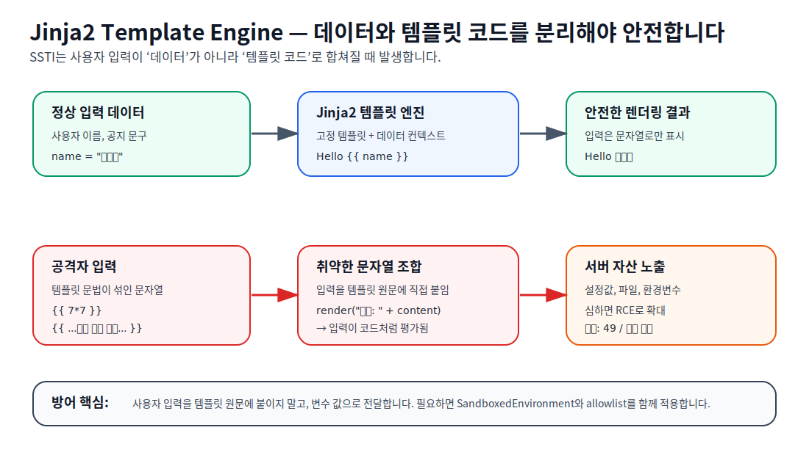

# Jinja2 Template Engine — 보안 용어 해설

## Step 1: 단어 직역 및 쉬운 비유

### 1. 용어 풀이

**Jinja2**는 Python 생태계에서 널리 쓰이는 **템플릿 엔진(template engine)**입니다.  
템플릿 엔진은 HTML, 이메일, 문서 같은 출력물의 **고정된 틀**에 서버가 가진 **동적 데이터**를 끼워 넣어 최종 결과를 만드는 도구입니다.

| 단어 | 직역 | 보안 관점 의미 |
|------|------|----------------|
| Template | 서식, 양식 | `Hello {{ name }}`처럼 빈칸이 있는 출력 틀 |
| Engine | 엔진 | 템플릿 문법을 해석하고 결과를 만드는 실행기 |
| Jinja2 | Python 템플릿 엔진 | Flask 등 Python 웹앱에서 자주 쓰이는 렌더링 도구 |

### 2. 의미 조합

> **Jinja2 Template Engine**은 서버가 가진 데이터를 `{{ name }}` 같은 템플릿 문법에 넣어 HTML 등 최종 문서를 렌더링하는 Python 계열 템플릿 엔진입니다.

### 3. 쉬운 비유: “학교 방송문 자동 작성기”

학교 방송 담당 선생님에게 이런 양식이 있다고 생각하면 됩니다.

```text
오늘의 공지: {{ announcement }}
```

정상 학생이 “체육대회는 금요일입니다”라고 쓰면 방송문은 그대로 완성됩니다.  
하지만 누군가 `{{ 7*7 }}`처럼 **양식 기계가 명령으로 알아듣는 문법**을 입력했고, 시스템이 그것을 단순 문장이 아니라 템플릿 코드로 다시 해석한다면 문제가 됩니다. 이것이 [[ssti|SSTI]]의 핵심입니다.

---

## Step 2: 개념 시각화



**다이어그램 설명**
- **정상 흐름**: 고정 템플릿과 사용자 데이터가 분리되어 Jinja2가 안전하게 렌더링합니다.
- **취약 흐름**: 사용자 입력을 템플릿 원문에 문자열로 붙이면, 입력값이 데이터가 아니라 템플릿 코드로 평가될 수 있습니다.
- **위험 결과**: 내부 객체, 설정값, 파일, 환경변수 접근으로 이어지고 심하면 [[rce|RCE]]가 가능합니다.

---

## Step 3: 전문 용어 설명

Jinja는 공식 문서에서 “빠르고 표현력 있으며 확장 가능한 templating engine”으로 설명됩니다. 템플릿 안의 특수 placeholder와 Python 유사 문법을 사용해 데이터를 최종 문서로 렌더링합니다. Jinja2는 Flask 등 Python 웹 프레임워크와 함께 Web CTF 및 실제 웹 애플리케이션에서 자주 등장합니다.

보안상 중요한 지점은 **템플릿 원문(template source)**과 **데이터 컨텍스트(data context)**를 분리하는 것입니다. 안전한 사용은 개발자가 작성한 고정 템플릿에 사용자 입력을 변수 값으로 전달하는 방식입니다. 반대로 사용자 입력을 템플릿 문자열 자체에 결합한 뒤 렌더링하면, 공격자가 `{{ ... }}` 같은 native template syntax를 주입해 서버 측에서 평가되도록 만들 수 있습니다. PortSwigger와 OWASP WSTG는 이 패턴을 [[ssti-core|Server-Side Template Injection]]의 전형적인 원인으로 설명합니다.

Jinja는 `SandboxedEnvironment`를 제공해 신뢰할 수 없는 템플릿의 attribute access, method call, operator, mutable data access 등을 제한할 수 있습니다. 다만 Jinja 공식 문서는 sandbox가 완전한 보안 해결책은 아니며, 필요한 데이터만 전달하고 resource limit 및 예외 처리를 함께 적용해야 한다고 설명합니다.

## Web CTF에서 보는 관찰 포인트

| 관찰 | 의미 |
|------|------|
| `{{ 7*7 }}` 입력 후 `49` 출력 | 템플릿 수식이 서버에서 평가됨 |
| `{{ config }}` 또는 내부 객체 출력 | Flask/Jinja 컨텍스트 노출 가능성 |
| 특정 단어 차단 후 우회 필요 | blacklist 기반 필터 가능성 |
| 파일 내용이나 환경변수 노출 | [[rce]] 또는 file-read로 확대 가능 |

## 공격자 관점

- 먼저 `{{ 7*7 }}` 같은 무해한 산술 표현으로 템플릿 평가 여부를 확인합니다.
- 응답 차이, 에러 메시지, 출력 형식으로 Jinja2/Twig/ERB 등 엔진을 식별합니다.
- CTF에서는 내부 객체 접근, builtin 접근, 필터 우회가 주요 학습 포인트입니다.

## 방어자 관점

- 사용자 입력을 템플릿 문자열 원문에 연결하지 않습니다.
- 입력은 변수 값으로만 전달하고, autoescape 및 context-aware escaping을 유지합니다.
- 사용자 작성 템플릿이 필요한 경우 `SandboxedEnvironment`, allowlist, resource limit, 예외 처리를 함께 사용합니다.
- blacklist 기반 문자열 차단보다 설계상 분리와 최소 권한 데이터 전달이 우선입니다.

## 관련 CTF

- [[ssti1-final-writeup]] — picoCTF 2025 SSTI1 문제에서 Jinja2 SSTI 확인과 파일 읽기 흐름을 정리한 writeup
- [[ssti-ctf-patterns]] — Web CTF에서 SSTI 문제를 볼 때의 기본 실험 순서

## 관련 개념

- [[ssti]]
- [[ssti-core]]
- [[ssti-defense]]
- [[rce]]
