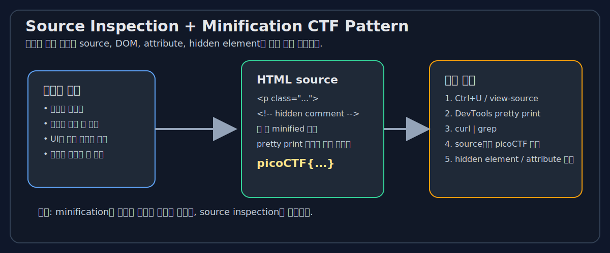

# Source Inspection + Minification

## 참고 URL
- [Original source](https://github.com/noamgariani11/picoCTF-2024-Writeup/blob/main/Web%20Exploitation/Unminify.md)
- [medium.com](https://medium.com/@erichdryn/unminify-picoctf-writeup-d62cfd67b8f5)
- [Original source](https://github.com/snwau/picoCTF-2024-Writeup/blob/main/Web%20Exploitation/Unminify/Unminify.md)
- [Original source](https://github.com/Cajac/picoCTF-Writeups/blob/main/picoCTF_2024/Web_Exploitation/Unminify.md)
- [developer.chrome.com](https://developer.chrome.com/docs/devtools/)
- [developer.mozilla.org](https://developer.mozilla.org/en-US/docs/Learn_web_development/Howto/Tools_and_setup/What_are_browser_developer_tools)

## 1. 쉬운 비유
웹페이지를 **인쇄물**이라고 생각하면 쉽습니다. 화면에 보이는 것은 "표지"이고, 실제 내용은 "본문"입니다. 이 문제 유형은 표지를 아무리 봐도 답이 없고, 본문을 직접 열어봐야 답이 나옵니다. 

minification은 글을 숨기는 것이 아니라 **띄어쓰기와 줄바꿈을 줄여서 한 줄로 압축하는 작업**입니다. 즉, 읽기 어려워질 뿐 내용이 사라지지는 않습니다.

연결 개념: [[web-inspector-ctf-patterns]], [[unminify-final-writeup]], [[webdecode-final-writeup]], [[source-inspection-hidden-file-writeup-survey]], [[hidden-dom-final-writeup]]

## 2. 시각화

## 3. 전문 설명
`source inspection`은 브라우저가 렌더링한 결과가 아니라 HTML 원문, DOM 구조, 주석, attribute, 포함된 자원(JS/CSS)을 검토해 숨은 정보를 찾는 분석 방식입니다. `minification`은 코드의 공백, 개행, 들여쓰기를 제거해 전송 크기와 파싱 비용을 줄이는 전처리 기법입니다.

이 둘이 함께 나타나는 Web CTF에서는 렌더링된 화면에 아무 정보가 없어도, 원본 HTML에 플래그, 힌트, hidden element, comment, class attribute가 그대로 들어 있는 경우가 많습니다. 따라서 기본 대응은 다음 순서가 됩니다.

1. `Ctrl+U` 또는 `view-source:` 로 원본을 엽니다.
2. DevTools에서 pretty print를 사용해 한 줄 코드를 읽기 쉽게 바꿉니다.
3. `picoCTF`, `flag`, `hidden`, `comment` 같은 키워드로 source를 검색합니다.
4. `curl` / `wget` / `grep`으로 CLI 검사를 병행합니다.

## 4. CTF 관찰 포인트
- HTML comment 안에 플래그가 있는지 확인합니다.
- `class`, `id`, `data-*`, `meta` tag에 값이 숨어 있는지 봅니다.
- 렌더링되지 않는 hidden element가 있는지 확인합니다.
- source가 한 줄로 붙어 있으면 pretty print 후 다시 읽습니다.
- `grep -oE 'picoCTF\{[^}]+\}'` 같은 패턴 추출을 시도합니다.

## 5. 공격자 관점 흐름
1. 페이지를 연 뒤 렌더링된 화면이 아닌 source를 먼저 봅니다.
2. `picoCTF` 문자열이나 `<!-- ... -->` 주석을 찾습니다.
3. 클래스나 data attribute에 플래그 형식 문자열이 있는지 확인합니다.
4. `curl` 로 HTML을 받아 동일한 검색을 반복합니다.
5. 필요한 경우 DevTools로 pretty print 후 수동 확인합니다.

## 6. 방어 관점
- 민감한 정보는 HTML source에 넣지 않습니다.
- minification은 보안 통제가 아니므로, 숨김 수단으로 사용하면 안 됩니다.
- 클라이언트에 전달된 데이터는 공격자에게 공개된 것으로 봐야 합니다.
- 주석, hidden element, data attribute도 민감정보 저장소가 될 수 있습니다.

## 7. 관련 writeup
- [[unminify-final-writeup]]
- [[webdecode-final-writeup]]
- [[bookmarklet-final-writeup]]
- [[web-ctf-writeup-client-side]]

## 8. 한 줄 요약
**화면이 아니라 source를 읽는 습관**이 이 계열 문제의 핵심입니다.
